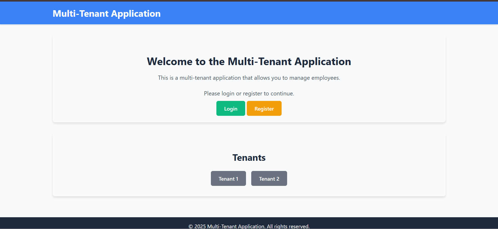
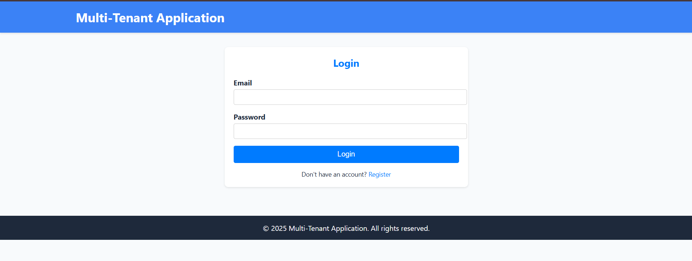
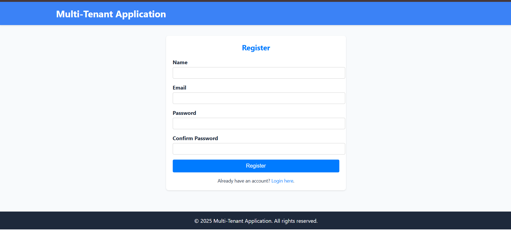

# Multi-Tenant Laravel Application

This is a multi-tenant application built with Laravel, where each tenant (organization) can manage their own set of data independently. The application supports CRUD operations for employees, role-based access control (RBAC), and advanced features like search, filtering, and reporting.

## Table of Contents
- [Features](#features)
- [Setup Instructions](#setup-instructions)
- [API Documentation](#api-documentation)
- [Testing](#testing)
- [Contributing](#contributing)
- [License](#license)

## Features
- **Multi-Tenancy**: Each tenant has its own database schema or separate tables within a single database.
- **CRUD Operations**: Manage employees with attributes like name, email, position, department, salary, and joining date.
- **Role-Based Access Control (RBAC)**: Restrict access based on user roles (Admin, Manager, Employee).
- **Advanced Search and Filtering**: Filter employees by department, position, salary range, etc.
- **Reporting**: Generate summary reports (e.g., total employees per department, average salary) with export options (PDF, CSV).
- **RESTful APIs**: Fully documented APIs for external clients or frontend applications.

## Setup Instructions
### Prerequisites
- PHP 8.0 or higher
- Composer
- MySQL or another supported database
- Node.js (for frontend assets)

### Steps to Set Up the Application
1. **Clone the Repository:**
   ```bash
   git clone https://github.com/your-repo/multi-tenant-app.git
   cd multi-tenant-app
   ```

2. **Install Dependencies:**
   ```bash
   composer install
   npm install
   ```

3. **Set Up Environment:**
   - Copy `.env.example` to `.env`:
     ```bash
     cp .env.example .env
     ```
   - Update the `.env` file with your database credentials:
     ```env
     DB_CONNECTION=mysql
     DB_HOST=127.0.0.1
     DB_PORT=3306
     DB_DATABASE=multi_tenant_app
     DB_USERNAME=root
     DB_PASSWORD=your_password
     ```

4. **Generate Application Key:**
   ```bash
   php artisan key:generate
   ```

5. **Run Migrations:**
   ```bash
   php artisan migrate
   ```

6. **Seed the Database (Optional):**
   ```bash
   php artisan db:seed
   ```

7. **Start the Development Server:**
   ```bash
   php artisan serve
   ```

8. **Compile Frontend Assets (if applicable):**
   ```bash
   npm run dev
   ```

9. **Access the Application:**

   Open your browser and go to  
   
   `http://127.0.0.1:8000`.

10. **Environment for Multi-Tenancy:**

   `http://tenant1.localhost:8000/login`

   `http://tenant2.localhost:8000/login`
   


## API Documentation
### Base URL
```
http://127.0.0.1:8000/api
```

### Authentication
Use Sanctum for API authentication.

**Obtain a token by logging in:**
```bash
POST /api/login
```
**Request Body:**
```json
{
    "email": "admin@example.com",
    "password": "password"
}
```
**Response:**
```json
{
    "user": { ... },
    "token": "your-auth-token"
}
```
**Headers:**
```
Authorization: Bearer your-auth-token
```

### API Endpoints List

```bash
------------------------------------------------------------
GET      /api/employees     // get all employees list
------------------------------------------------------------
POST     /api/employees     //  create new employee
------------------------------------------------------------
GET      /api/employees/id  // get employee by id
------------------------------------------------------------
PUT      /api/employees/id  // update employee data
------------------------------------------------------------
DELETE   /api/employees     // Delete employee by id
------------------------------------------------------------
```

#### Create an Employee
```bash
POST /api/employees
```
**Headers:**
```
Authorization: Bearer your-auth-token
```
**Request Body:**
```json
{
    "name": "John Doe",
    "email": "john@example.com",
    "position": "Developer",
    "department": "IT",
    "salary": 50000,
    "joining_date": "2025-01-01"
}
```

#### Update an Employee
```bash
PUT /api/employees/{id}
```
**Headers:**
```
Authorization: Bearer your-auth-token
```
**Request Body:**
```json
{
    "name": "John Doe Updated",
    "salary": 55000
}
```

#### Delete an Employee
```bash
DELETE /api/employees/{id}
```
**Headers:**
```
Authorization: Bearer your-auth-token
```

## License
This project is licensed under the MIT License. See the `LICENSE` file for details.

## Screenshot






